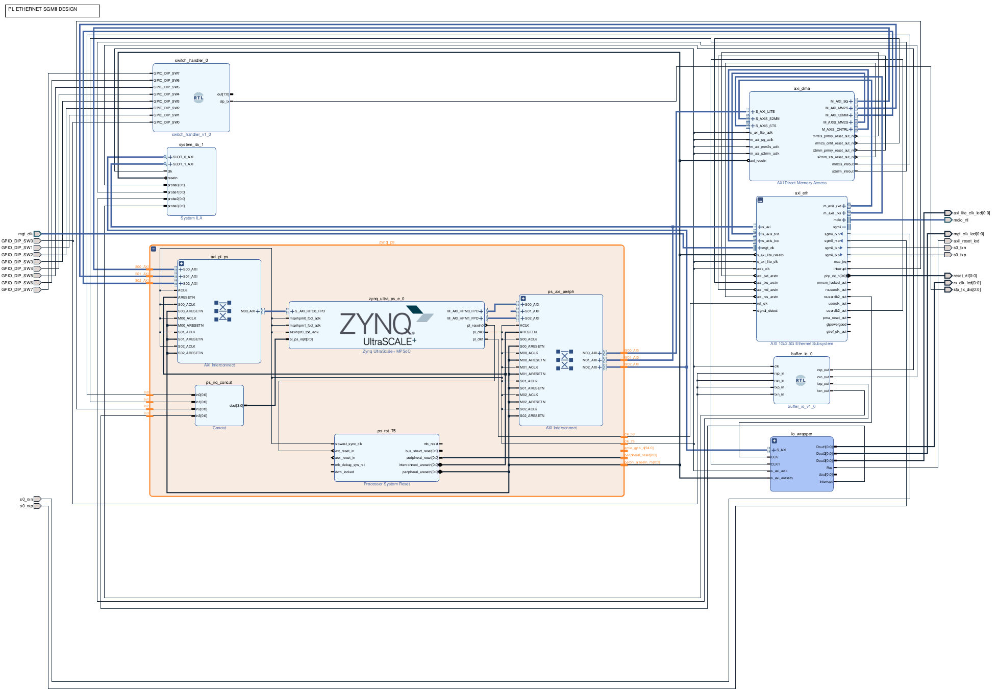
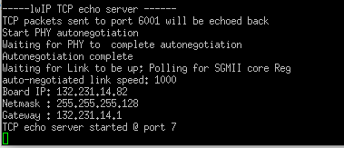
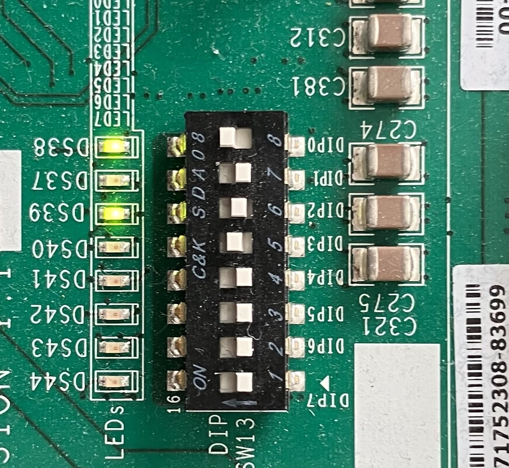

# ZCU102 SFP+ Ethernet Implementation

This repository contains an implementation of Ethernet on the PL, enabling access to Gigabit SFP interfaces. The design can be utilized by the PS to connect to an lwIP stack.
The design is based on the [Xilinx ZCU102 Ethernet implementation](https://github.com/Xilinx-Wiki-Projects/ZCU102-Ethernet). It utilizes the SFP+ connector provided by the ZCU102 Evaluation Board.

## Requirements

To use this implementation, you need the following:

- ZCU102 Evaluation Board
- Cisco GLC-T compatible SFP+ interface ([QSFPTEK QT-SFP-T](https://www.amazon.de/dp/B081HZ8N47?ref=ppx_yo2ov_dt_b_fed_asin_title))
- [Xilinx TEMAC License](https://www.xilinx.com/products/intellectual-property/temac-order.html) for the Tri-Mode Ethernet MAC (TEMAC) IP core.

**Tested on Vivado 2022.1**

## Implementation

This implementation is based on the block design described in [PL_ETH_SGMII](https://github.com/Xilinx-Wiki-Projects/ZCU102-Ethernet/tree/main/2019.2/pl_eth_sgmii).

The block design is illustrated in the following figure:



### Overview

This design uses the AXI 1G/2.5G Ethernet Subsystem to access the transceivers, connected to the ZYNQ UltraScale+ system via the AXI streaming interface. The AXI 1G/2.5G Ethernet Subsystem is configured to use the GMII protocol (note: 1000BaseX was tested but did not work).

The AXI interface uses a DMA mapped into the address space with a data width of 128-bit. Can be accessed via AXI Ethernet on the PS side. Other modules like the io_wrapper or the buffer_io are simply to set debugging symbols or to enable the interfae. 


The `rx_p`, `rx_n`, `tx_p`, and `tx_n` signals are mapped to the SFP0 interface. The SFP interfaces on the ZCU102 board are arranged as follows:

|       |       |
|-------|-------|
| SFP2  | SFP0  |
| SFP3  | SFP1  |

### Constraints for SFP Interfaces

```Verilog
    set_property PACKAGE_PIN A12 [get_ports {sfp_tx_dis[0]}] // Must be driven high in order to enable the interface


    set_property PACKAGE_PIN D2 [get_ports s0_rxp];
    set_property PACKAGE_PIN D1 [get_ports s0_rxn];
    set_property PACKAGE_PIN E4 [get_ports s0_txp];
    set_property PACKAGE_PIN E3 [get_ports s0_txn];

```

In case one of the other SFP pins is used define the following constraints.


*SFP1:*

```Verilog
    set_property PACKAGE_PIN A13 [get_ports {sfp_tx_dis[0]}] // Must be driven high in order to enable the interface

    set_property PACKAGE_PIN C4 [get_ports s0_rxp]; # Bank 230 - MGTHRXP1_230
    set_property PACKAGE_PIN C3 [get_ports s0_rxn]; # Bank 230 - MGTHRXN1_230
    set_property PACKAGE_PIN D6 [get_ports s0_txp]; # Bank 230 - MGTHTXP1_230
    set_property PACKAGE_PIN D5 [get_ports s0_txn]; # Bank 230 - MGTHTXN1_230

```

*SFP2:*

```Verilog
    set_property PACKAGE_PIN B13 [get_ports {sfp_tx_dis[0]}] // Must be driven high in order to enable the interface

    set_property PACKAGE_PIN B2 [get_ports s0_rxp]; # Bank 230 - MGTHRXP2_230
    set_property PACKAGE_PIN B1 [get_ports s0_rxn]; # Bank 230 - MGTHRXN2_230
    set_property PACKAGE_PIN B6 [get_ports s0_txp]; # Bank 230 - MGTHTXP2_230
    set_property PACKAGE_PIN B5 [get_ports s0_txn]; # Bank 230 - MGTHTXN2_230

```

*SFP2:*

```Verilog
    set_property PACKAGE_PIN C13 [get_ports {sfp_tx_dis[0]}] // Must be driven high in order to enable the interface

    set_property PACKAGE_PIN A4 [get_ports s0_rxp]; # Bank 230 - MGTHRXP3_230
    set_property PACKAGE_PIN A3 [get_ports s0_rxn]; # Bank 230 - MGTHRXN3_230
    set_property PACKAGE_PIN A8 [get_ports s0_txp]; # Bank 230 - MGTHTXP3_230
    set_property PACKAGE_PIN A7 [get_ports s0_txn]; # Bank 230 - MGTHTXN3_230

```

### GT Location Setup for AXI Ethernet

When configuring the **AXI 1G/2.5G Ethernet Subsystem**, you must set the correct **GT location**. This can be done under the *Locations* tab of the IP Core configuration. The GT locations for each SFP interface are as follows:

- **X1Y12** for **SFP0**
- **X1Y13** for **SFP1**
- **X1Y14** for **SFP2**
- **X1Y15** for **SFP3**

### Management Clock Configuration

To drive the AXI 1G/2.5G Ethernet Subsystem, the management clock must be set to **156.25 MHz**, which corresponds to a clock period of **6.4 ns**. You can configure this using the following command in your constraint file:


```Verilog
    create_clock -period 6.400 -name mgt_clk [get_ports mgt_clk_clk_p]
```

**Specifying the clock with a phase of 8 ns and thus 125 MHz as written in verious tutorials is not working!**

Additionally the PL DIP SW13 array of 8 switches is utilize for test purposes. 
There, button SW1 must be enabled, in order to drive **sfp_tx_disable** high and able the sfp interface. 

Furthermore make sure you bridge Jumper J16 in order to enable the interface.


### Using the SFP Interface in an Application

To use the SFP interface within an application, export the bitstream by navigating to **File -> Export -> Hardware -> Include Bitstream**. The resulting `.xsa` file can then be imported into Vitis, where you can test a sample application, such as **LwIP Echo**.

When you start the application, the output should look similar to the following:



> **Note:** If your module is not supported, the application may hang at `Waiting for PHY to complete autonegotiation`.

### Debugging

For debugging purposes, several signals are forwarded to the PL LEDs located above the SW13 switch array.

The LEDs indicate the following statuses:

- **LED 0 (AG14/DS38):** AXI Reset — This should remain constantly high, indicating no reset operation is being performed.
- **LED 2 (AE13/DS39):** AXI Light Clock — Used to verify that the management interface for the DMA module is operational.
- **LED 4 (AJ15/DS41):** Management Clock — Ensures that the management clock is correctly configured to **156.25 MHz**.
- **LED 6 (AH14/DS43):** RX Clock Output — Used to check if data is being received by the interface.

The following figure shows the LED interface. Please note that **Switch 8** must be set to **high** to enable the interface:



You can further debug using the System ILA module to debug the AXI bus and other signals such as interrupts from the PL to the PS.